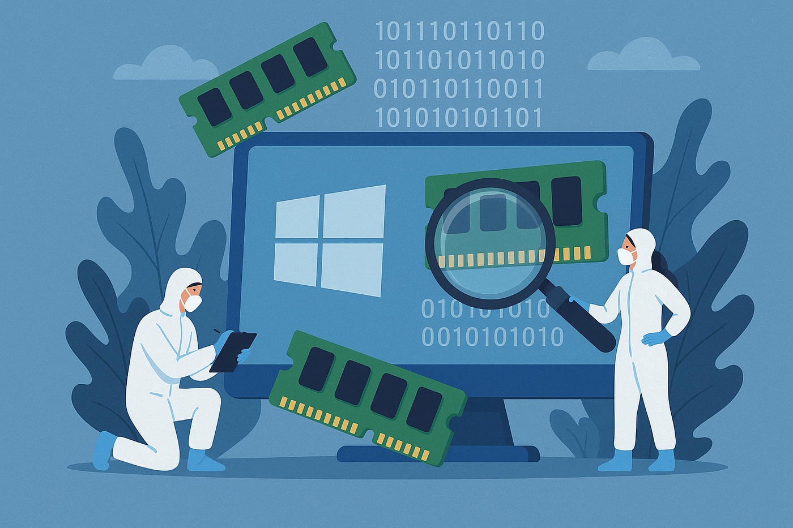
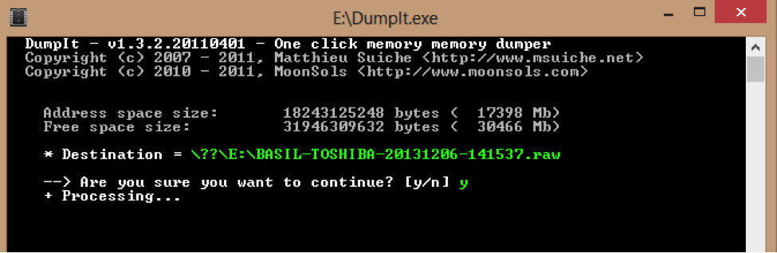
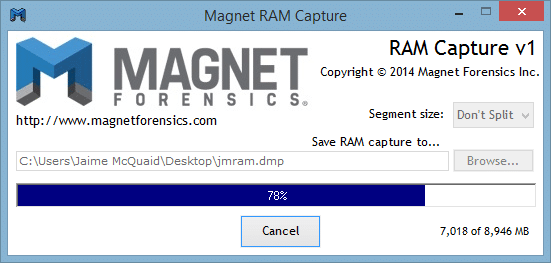
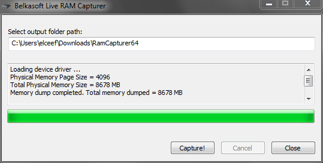

# Memory Acquisition (RAM Forensics)

  

---

## ❓ Why are we collecting memory first?

When a Windows system is compromised, the most valuable evidence often exists in **RAM (volatile memory)**.

Unlike disk artifacts, memory contains **live execution state**, which disappears immediately when the system shuts down or restarts.

This makes memory acquisition the **highest priority step in any DFIR investigation**.

**⚠️ Golden Rule of DFIR :**

> 🧠 “If the machine is ON → memory must be acquired FIRST.”

---

## 🎯 Why Memory Forensics is Critical

Memory analysis helps investigators uncover:

1. Fileless Malware : Attackers often execute payloads directly in memory without writing files to disk.

### 🔹 2. Injected Code & Processes
Malware may inject code into legitimate processes (e.g., explorer.exe, svchost.exe).

### 🔹 3. Active Network Connections
Live C2 (Command & Control) sessions are visible only in memory.

### 🔹 4. Credentials & Secrets
Memory may contain Passwords, Kerberos tickets, API keys, Encryption keys, ...

### 🔹 5. Decrypted Payloads
Even if malware is encrypted on disk, it is often **decrypted in RAM during execution**.

---

## 🧰 Best Free Tools for Memory Acquisition

We focus on **trusted, widely used, free DFIR tools**:

### 🔧 1. DumpIt (Recommended)

  

- Simple one-click memory capture tool
- Widely used in incident response

---

### 🔧 2. Magnet RAM Capture

  

- Lightweight GUI-based tool
- Good for forensic beginners

---

### 🔧 3. Belkasoft Live RAM Capturer

  

- Stealthier acquisition option
- Minimal footprint on system

---

## 🧪 Recommended Method: DumpIt (Step-by-Step)

### Step 1 — Prepare Secure Environment

- Plug in a clean USB drive
- Ensure external storage has enough free space (RAM size × 1.2 recommended)

---

### Step 2 — Run as Administrator

Right-click `DumpIt.exe` → Run as Administrator
You will see a prompt:

``Proceed with the acquisition ? [y/n]``

---

### Step 3 — Start Acquisition

Press:

``y``

DumpIt will:
- Lock system memory snapshot
- Begin full RAM capture

---

### Step 4 — Wait for Completion

Depending on system RAM size:
- 4–16 GB → few minutes
- 32+ GB → longer duration

Do NOT interact with system during capture.

---

### Step 5 — Output File

DumpIt generates:

``<hostname>-<date>.raw``
