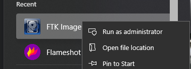
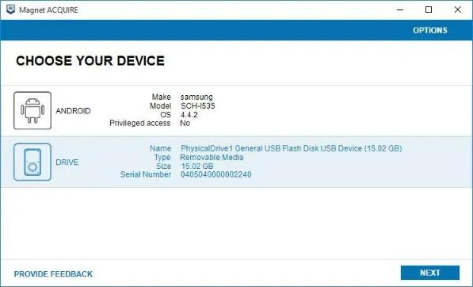
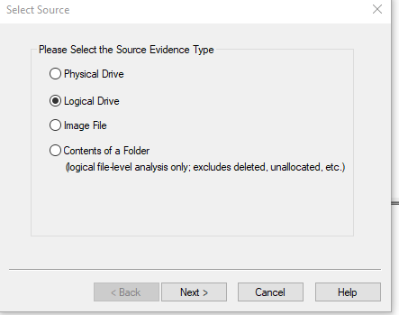
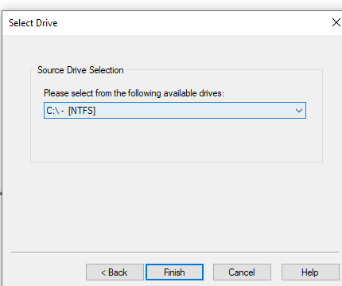

# Disk Imaging (Full Forensic Image)

## Why are we collecting a disk image?

After acquiring volatile and live system data, the next step is to capture a **full forensic image of the Windows disk**.

A disk image is a bit-by-bit copy of the entire storage device, including the operating system, installed applications, user data, deleted files, and hidden forensic artifacts. Unlike volatile memory, disk evidence persists after shutdown and allows deep post-incident analysis.

This step is essential to reconstruct what happened on the system before, during, and after the compromise.

---

## Why Disk Imaging is Critical

Disk imaging allows investigators to uncover:

- **Malware Files :** Identify malicious executables, scripts, and payloads stored on disk.

- **Persistence Mechanisms :** Detect startup entries, scheduled tasks, services, and registry-based persistence.

- **Deleted Artifacts :** Recover deleted files that may still contain valuable forensic evidence.

- **User Activity :** Analyze downloads, documents, execution history, and file access patterns.

- **Hidden Evidence :** Detect alternate data streams, hidden partitions, and obfuscated attacker artifacts.

---

## Best Free Tools for Windows Disk Imaging

We focus on trusted, widely used, free DFIR tools:

### 1. FTK Imager (Recommended)

  

FTK Imager is one of the most widely used forensic imaging tools in DFIR investigations. It allows investigators to create full disk images while preserving evidence integrity and supports hashing for verification.

---

### 2. Magnet Acquire

  

Magnet Acquire is a lightweight Windows forensic acquisition tool used to capture disk images and key artifacts. It is designed for simplicity and reliability in incident response workflows.

---

## ⚠️ Should FTK Imager be installed on the suspect machine?

FTK Imager should NOT be installed directly on the compromised system. In proper DFIR practice, it should be executed as a portable tool from an external USB or forensic drive.

Installing software on the suspect machine introduces unwanted changes to the system, such as registry modifications, file writes, and system logs. These changes can contaminate evidence and reduce forensic integrity.

It is important to understand that installing FTK Imager does NOT change the hash of already existing files or disk evidence. However, it does modify the system state, which is critical in forensic investigations.

For this reason, investigators always prefer running FTK Imager from a clean external device to ensure minimal interaction with the target system and preserve evidence integrity.

---

## 🧪 Recommended Method: FTK Imager (Full Disk Acquisition)

To perform disk imaging, connect a clean external storage device and launch FTK Imager with administrative privileges from a trusted forensic workstation or portable USB environment.

  

Select the option to create a disk image and choose the **logical drive option**.

  

Select the **C:\ partition (Windows system volume)** of the target machine. This approach is faster and requires less storage compared to physical acquisition, while still capturing all active files and folder structures from the operating system perspective.

  

Configure the destination path on the external drive and select a forensic image format such as E01.

During acquisition, enable hash verification (MD5 and SHA256) to ensure integrity of the evidence. FTK Imager will then perform a logical copy of the selected volume, including all accessible files, system data, and user data, but excluding unallocated space and most deleted artifacts.

Once the acquisition is complete, the resulting image and hash values must be securely stored and documented for chain-of-custody purposes.

