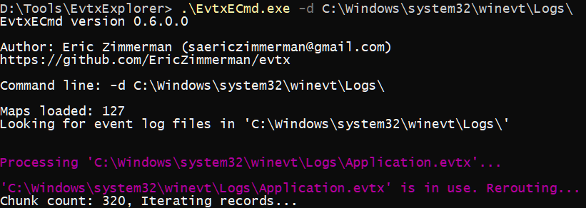
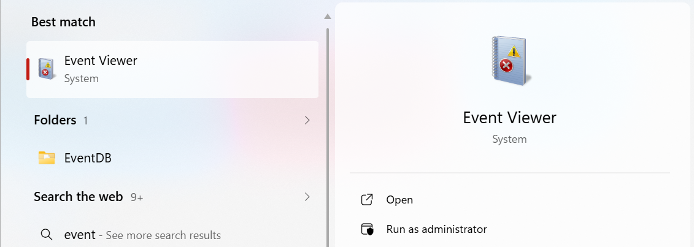

# Windows Event Logs

## Why are we collecting Windows Event Logs?

After acquiring memory and disk images, Windows Event Logs provide a **chronological record of system and user activity**.

They are one of the most valuable sources for reconstructing attacker behavior and identifying **initial access, persistence, lateral movement, and impact**.

Unlike memory (volatile) and disk (static), event logs offer **structured, timestamped evidence** of what happened on the system.

**⚠️ Golden Rule of DFIR :**

> “Logs tell the story — preserve them before they are overwritten or cleared.”

---

## Why Windows Event Logs are Critical?

Event logs help investigators uncover:

- **Authentication Activity**
    - Successful and failed logins (brute force attempts)
    - Logon types (interactive, remote, RDP)

- **Privilege Escalation**
    - Accounts added to administrators group
    - Special privileges assigned to processes

- **Process Execution**
    - Process creation (including suspicious binaries)
    - Parent-child process relationships

- **Persistence Mechanisms**
    - Service creation or modification
    - Scheduled task creation

- **System & Security Events**
    - System reboots, crashes, shutdowns
    - Audit policy changes or log clearing attempts

---

## Key Windows Event Logs to Collect

The most important logs in Windows DFIR:

- **Security.evtx**
    - Authentication events (Event ID 4624, 4625)
    - Account changes, privilege escalation

- **System.evtx**
    - System startups/shutdowns
    - Driver loads, service activity

- **Application.evtx**
    - Application crashes and execution traces

- **Microsoft-Windows-PowerShell/Operational.evtx**
    - PowerShell execution and script logging

- **Microsoft-Windows-TaskScheduler/Operational.evtx**
    - Scheduled task creation and execution

- **Microsoft-Windows-Sysmon/Operational.evtx (if Sysmon is installed)**
    - Detailed process, network, and file activity

---

## Best Free Tools for Event Log Collection

### [1. EvtxECmd (Recommended)](https://github.com/EricZimmerman/evtx)

  

A powerful DFIR tool designed to parse and extract Windows Event Logs into structured formats such as CSV and JSON for advanced analysis. It enables investigators to efficiently process large volumes of .evtx files and integrate the results into SIEM platforms or timeline analysis workflows.

---

### [2. Windows Event Viewer](https://learn.microsoft.com/en-us/shows/inside/event-viewer)

  

A native Windows graphical interface that allows analysts to view, filter, and export event logs directly from the system in real time. It is useful for quick triage and manual inspection, but should not be relied upon as the primary acquisition method due to potential filtering and data limitations.