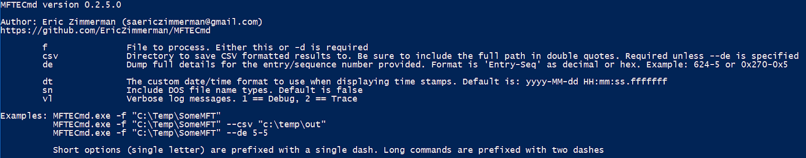
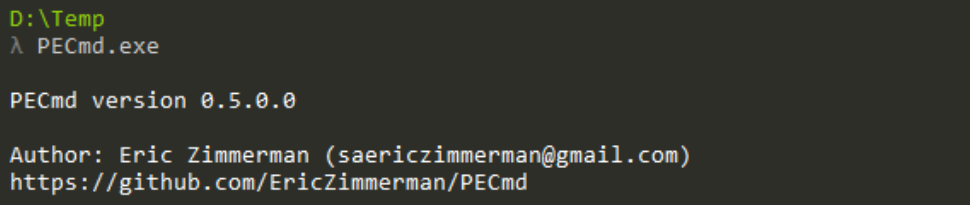
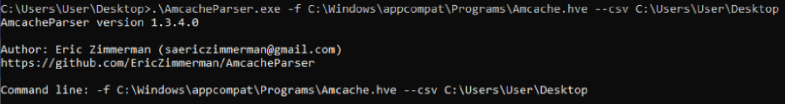

# Timeline Artifacts (MFT, Prefetch, Amcache)

## Why are we collecting Timeline Artifacts?

After collecting logs, registry, and user artifacts, **timeline artifacts help reconstruct a precise sequence of events on the system**.

They allow investigators to answer:

- What executed?
- When did it run?
- What files were created or modified?
- What persistence or malware activity occurred over time?

These artifacts are essential for building a **true attack timeline (minute-by-minute reconstruction)**.

---

## Why Timeline Artifacts are Critical

Timeline sources help uncover:

- **Execution History :** What programs ran and when
- **File System Activity :** Creation, modification, and deletion of files
- **Persistence Traces :** Auto-start execution evidence over time
- **Attacker Behavior Flow :** Chain of execution from initial access → payload → persistence → impact

---

## MFT (Master File Table)

```bash
C:\$MFT
```

The **MFT is the core database of NTFS file system activity**, recording every file and directory on the disk.

It provides:

- File creation timestamps
- File modification history
- File renames and deletions
- Evidence of hidden or deleted files

---

## Prefetch

```bash
C:\Windows\Prefetch\
```

Prefetch files record **application execution history**, showing which programs were run and how often.

They help answer:

- What executable ran?
- When was it last executed?
- How many times was it executed?

---

## Amcache

```bash
C:\Windows\AppCompat\Programs\Amcache.hve
```

Amcache stores **application execution metadata**, even after deletion.

It records:

- First execution time
- File path of executables
- SHA1 hashes of binaries
- Installed or executed applications

---

## Tools for Analyzing Timeline Artifacts (MFT, Prefetch, Amcache)

### MFTECmd (MFT)

<p align="center">
  
</p>

MFTECmd is a powerful forensic tool used to parse the ``$MFT`` file and extract detailed file system metadata into structured formats such as CSV. 
It allows investigators to analyze file creation, modification, deletion, and identify suspicious or hidden artifacts across the NTFS file system.

---

### PECmd (Prefetch)

<p align="center">
  
</p>

PECmd is a specialized tool designed to parse Windows Prefetch files and extract execution-related metadata. 
It provides insights into executed programs, run counts, last execution times, and associated file activity, making it essential for detecting malware execution.

---

### AmcacheParser (Amcache)

<p align="center">
  
</p>

AmcacheParser is used to analyze the ``Amcache.hve`` registry hive and extract execution evidence for programs run on the system.
It provides valuable details such as file paths, SHA1 hashes, and first execution timestamps, even for files that have been deleted.


