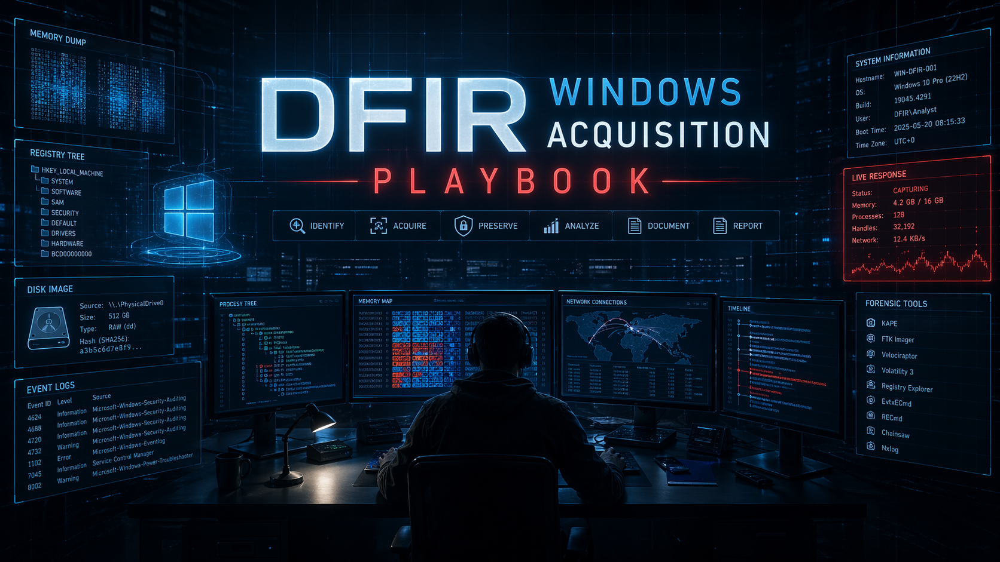

<h1 align="center">DFIR Windows Acquisition Playbook</h1>

  <b>Windows forensic acquisition workflow for incident response and evidence collection</b>

  

---

## ❓ Scenario

A Windows machine is suspected to be **compromised**.

Possible indicators include:
- Suspicious processes or malware execution
- Unknown network connections or C2 traffic
- Evidence of persistence mechanisms
- Potential data exfiltration or credential theft

The system may still be **live or already powered off**, requiring a structured forensic acquisition approach.

---

## 🎯 Objectives

This playbook provides a **standardized DFIR acquisition workflow** to:

- Preserve **volatile evidence first (memory, live data)**
- Collect **disk-level forensic images**
- Extract **Windows artifacts (logs, registry, persistence)**
- Recover **user and attacker activity traces**
- Enable **timeline reconstruction of the incident**
- Support **incident response and forensic investigation**

---

## 📚 Table of Contents

1. [Memory Acquisition (RAM Dump)](01-memory-acquisition.md)
2. [Live System Collection (Processes & Network)](02-live-system-collection.md)
3. [Disk Imaging (Full Forensic Image)](03-disk-imaging.md)
4. [Windows Event Logs](04-windows-event-logs.md)
5. [Registry Artifacts & Persistence](05-registry-artifacts.md)
6. [User Artifacts (AppData / Temp / Downloads)](06-user-artifacts-appdata-temp.md)
7. [Browser Artifacts](07-browser-artifacts.md)
8. [Timeline Artifacts (MFT, Prefetch, Amcache)](08-timeline-artifacts.md)
9. [Network Artifacts](09-network-artifacts.md)

---

## 📌 Operational Summary

This repository is designed as a **structured DFIR acquisition guide** to ensure consistent, repeatable, and forensically sound evidence collection on compromised Windows systems.

It should be used as a reference during:
- Incident response investigations
- SOC escalation procedures
- Digital forensic analysis
- Threat hunting engagements